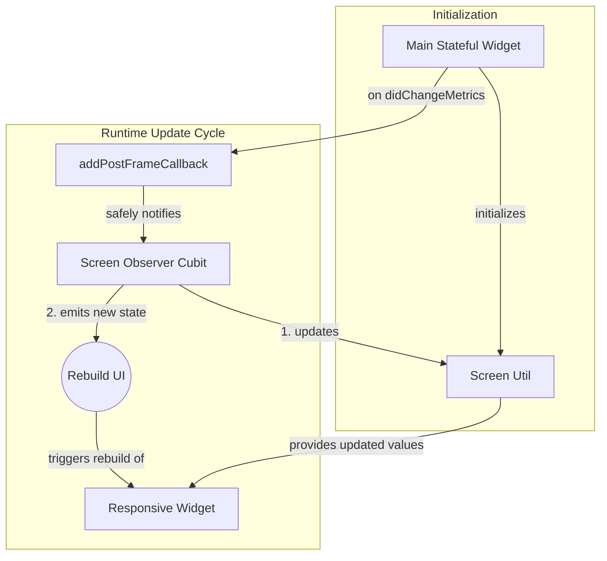
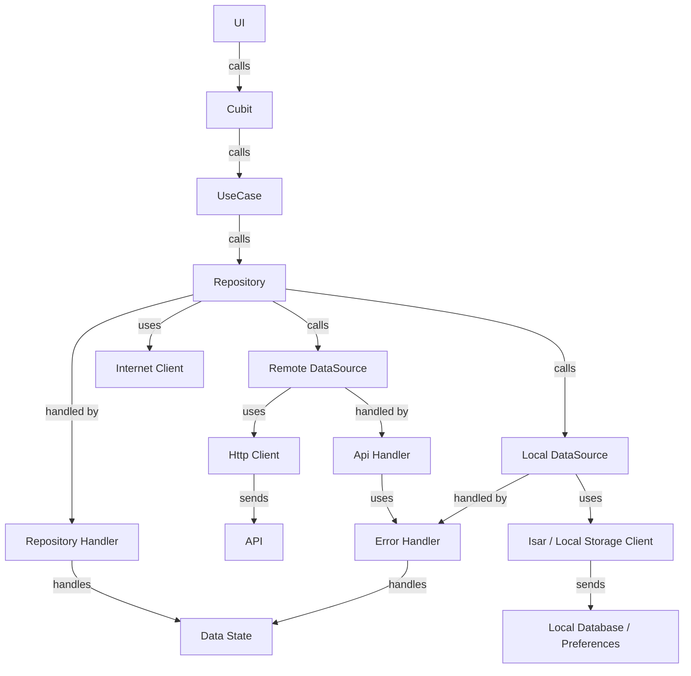
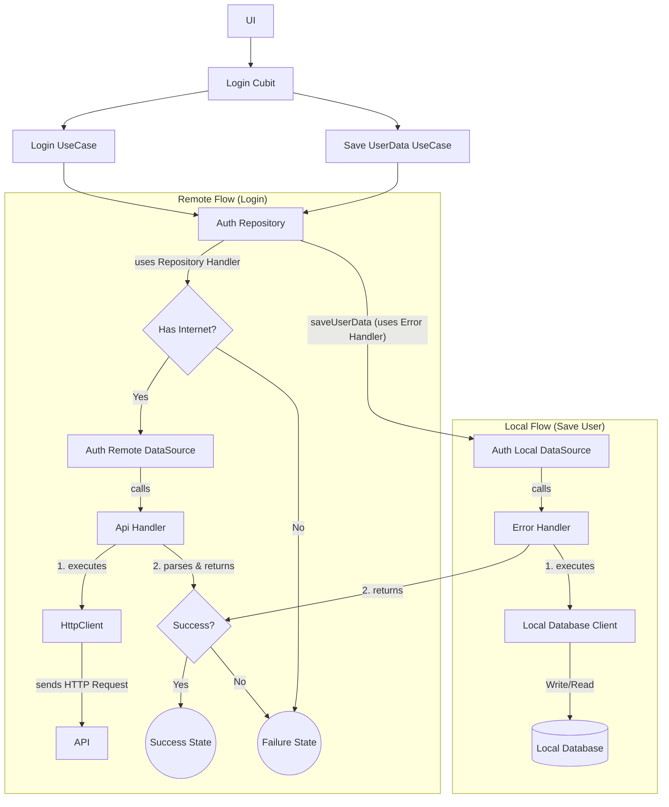

# Flutter Clean Architecture with SOLID Principles 🚀

A comprehensive guide to building scalable and maintainable Flutter applications using **Clean Architecture** pattern and **Solid Principle**.

For more details on specific commands and guidelines, refer to the following documents:

- [**Flutter Tips**](docs/flutter_tips.md): A collection of best practices for writing efficient, readable, and performant Flutter code.
- [**Flutter Commands Cheat Sheet**](docs/flutter_commands_cheat_sheet.md): A collection of essential and frequently used Flutter commands to boost your productivity.
- [**Flutter Configuration Guidelines**](docs/flutter_configuration_guidelines.md): Guidelines for setting up the Flutter environment, including activating pub commands, and managing the Java SDK location.
- [**Git Commands Cheat Sheet**](docs/git_commands_cheat_sheet.md): A collection of essential and frequently used git commands to boost your productivity.

## Table of Contents 📌

- [Flutter Clean Architecture with SOLID Principles 🚀](#flutter-clean-architecture-with-solid-principles-)
  - [Table of Contents 📌](#table-of-contents-)
  - [Introduction](#introduction)
  - [What is Clean Architecture?](#what-is-clean-architecture)
    - [Core Layers](#core-layers)
    - [Dependency rules that must be enforced](#dependency-rules-that-must-be-enforced)
    - [Benefits](#benefits)
  - [SOLID Principles](#solid-principles)
  - [Visual Representation](#visual-representation)
  - [Project Features](#project-features)
  - [Getting Started 🚀](#getting-started-)
    - [Prerequisites](#prerequisites)
    - [Installation \& Setup](#installation--setup)
  - [Project Structure](#project-structure)
  - [State Management with Bloc (Cubit)](#state-management-with-bloc-cubit)
  - [App Flavors](#app-flavors)
  - [Responsiveness](#responsiveness)
  - [Core Services](#core-services)
    - [API](#api)
    - [Internet Status](#internet-status)
    - [Navigation](#navigation)
    - [Session and LocalDatabase](#session-and-localdatabase)
    - [Image Picker](#image-picker)
  - [Data Handling](#data-handling)
  - [Data States](#data-states)
  - [API Workflow Overview](#api-workflow-overview)
    - [Data Flow Summary](#data-flow-summary)
    - [Core Components](#core-components)
    - [Example: Login Flow](#example-login-flow)
      - [Internal Flow](#internal-flow)
    - [Debugging Tools](#debugging-tools)
    - [What Do `cubit_feature` \& `cubit_page` Do?](#what-do-cubit_feature--cubit_page-do)
    - [Configuration](#configuration)
  - [Testing](#testing)
    - [Running Tests](#running-tests)
      - [Unit \& Widget Tests](#unit--widget-tests)
      - [Integration Tests (Patrol)](#integration-tests-patrol)

## Introduction

This project demonstrates how to structure Flutter applications using **Clean Architecture** and **SOLID Principles**. The goal is to create modular, testable, and maintainable codebases that scale with your application's growth.

## What is Clean Architecture?

**Clean Architecture** is a software design philosophy that promotes separation of concerns through clearly defined layers. Each layer has a specific responsibility, making the codebase modular, testable, and easier to maintain.

### Core Layers

1. **Presentation Layer**
   - Contains UI and state management (e.g., Cubits, Widgets, Pages).
   - Responsible for displaying data and handling user interactions.
   - May import domain/use-cases and core, but must NOT import feature data directly — always use repository interfaces / use-cases.

2. **Domain Layer**
   - The heart of the application. Contains **Entities**, **UseCases**, and **Repositories**.
   - Focuses purely on business logic, independent of frameworks.
   - Must not import from data or presentation.

3. **Data Layer**
   - Manages data sources (e.g., APIs, local databases).
   - Implements repositories to provide data to the domain layer.
   - May import domain to implement repository interfaces.

### Dependency rules that must be enforced

- Keep imports flowing inward only — Presentation -> Domain -> Data.
- Core is reusable library and should be independent of other layers but domain, data, presentation depends on core.
- Shared UI is reusable UI related library and It might depend on core but not other layers. Presentation layer depends on Shared UI.

### Benefits

- **Framework Independence**: Decouples business logic from frameworks, UI, and data sources.
- **Modularity**: Enables easier testing and maintenance.
- **Scalability**: Supports flexible and future-proof feature additions.

## SOLID Principles

**SOLID Principles** complement Clean Architecture by providing guidelines for writing clean, maintainable, and extensible code:

1. **Single Responsibility Principle (SRP)**  
   Each class should have only one reason to change.

2. **Open/Closed Principle (OCP)**  
   Classes should be open for extension but closed for modification.

3. **Liskov Substitution Principle (LSP)**  
   Subtypes must be substitutable for their base types without altering program correctness.

4. **Interface Segregation Principle (ISP)**  
   Classes should not be forced to implement interfaces they do not use.

5. **Dependency Inversion Principle (DIP)**  
   High-level modules should not depend on low-level modules; both should depend on abstractions.

For more detailed information and real-world examples, see the [**SOLID Principles documentation**](documentation/solid_principles.md).

## Visual Representation


> This diagram highlights the modular and scalable structure of Clean Architecture, aligning with **SOLID principles** to ensure best development practices.

## Project Features

- 🛡️ **SOLID Principles**: Ensures scalable, maintainable, and testable code.
- 🏗️ **Clean Architecture**: Divides code into layers (Data, Domain, Presentation) for clear separation of concerns.
- 🍴 **Build Flavors**: Supports Development, Staging, and Production environments.
- 🔧 **Robust Error Handling**: Comprehensive API and internal error management.
- 🔄 **Automated Request/Response Handling**: Includes token refreshing and request inspection.
- 📡 **Core Services**: Navigation, Internet, Local Database, Image Picker, Toast Messages, and User Credential management.
- 🎨 **Reusable UI Components**: Customizable themes and reusable widgets.
- ⚙️ **Utilities**: Screen size handling, extensions, mixins, generics, and form validation utilities.

## Getting Started 🚀

Follow these steps to get the project up and running on your local machine.

### Prerequisites

Ensure you have the following software installed:

- Flutter SDK (version `3.38.1`)
- Dart SDK (version `3.10.0`)
- Android Studio (for Android development)
- Xcode (for iOS development)
- Java 17 (Recommended, but optional)
- Add Flutter's pub cache to your shell's `PATH`. For Zsh, add this to your `~/.zshrc` file: `export PATH="$PATH":"$HOME/.pub-cache/bin"`.

### Installation & Setup

1. **Clone the repository:**

   ```bash
   git clone https://github.com/gaurishankar007/Flutter-Clean-Architecture.git
   cd Flutter-Clean-Architecture
   ```

2. **Install dependencies:**
   ```bash
   flutter pub get
   ```

## Project Structure

```
lib/
├── config/
│   ├── injector/
│   └── app_config.dart
├── core/
│   ├── clients/
│   │   ├── local/
│   │   └── remote/
│   │       └── http/
│   ├── constants/
│   ├── data/
│   │   ├── handlers/
│   │   ├── states/
│   │   └── models/
│   ├── domain/
│   │   ├── entities/
│   │   └── use_cases/
│   ├── utils/
│   │   ├── extensions/
│   │   └── image_picker_util.dart
│   └── app_initializer.dart
├── features/
│   ├── auth/
│   │   ├── data/
│   │   │   ├── data_sources/
│   │   │   │   ├── auth_local_data_source.dart
│   │   │   │   ├── auth_remote_data_source.dart
│   │   │   │   └── session_local_data_source.dart
│   │   │   └── repositories/
│   │   │       ├── auth_repository_impl.dart
│   │   │       └── session_repository_impl.dart
│   │   ├── domain/
│   │   └── presentation/
│   ├── dashboard/
│   └── ...
├── routing/
│   ├── helper/
│   │   └── navigation_client.dart
│   └── routes.dart
├── shared_ui/
│   ├── cubits/
│   ├── models/
│   ├── themes/
│   ├── ui/
│   ├── utils/
│   └── application.dart
├── main_dev.dart
├── main.dart
├── main_stg.dart
```

- **`config/`**: Environment and platform setup (flavor configs), dependency injection (`injector/`), and any Pigeon-generated platform bindings. `app_config.dart` holds flavor-specific values (base URLs, feature flags).
- **`core/`**: App-wide building blocks and reusable utilities. Contains constants, `DataState`/error types, core clients (HTTP client, local storage, connectivity/InternetClient), and general-purpose utilities.
- **`features/`**: Each feature follows Clean Architecture and is self-contained with three layers:
  - **`data/`**: Remote and local data sources (including repository pattern for session management), DTOs/models, and concrete repository implementations that map to domain entities.
  - **`domain/`**: Pure business logic (entities, use cases/interactors, and abstract repository interfaces). No Flutter or external deps here.
  - **`presentation/`**: Uses **Bloc (Cubit)** for state management. Contains `cubit/` (Cubit classes and their `State` classes), `views/` (pages/screens), and feature-specific `widgets/`.
- **`routing/`**: Centralized navigation and route declarations. Includes `NavigationClient` for context-free navigation.
- **`shared_ui/`**: Shared presentation primitives — reusable widgets, UI models, themes, and optional global cubits (e.g., `ScreenObserverCubit`, `ThemeCubit`). `application.dart` composes the `MaterialApp`, provides global dependencies, and wires routing.
- **Entry Points**:
  - `main.dart` → Production entry that initializes DI and runs `application.dart`.
  - `main_dev.dart` → Development entry (dev flags, debug tools enabled).
  - `main_stg.dart` → Staging entry (staging config).

Notes:

- Dependency injection typically uses `get_it` + `injectable` and is wired in `config/injector` and `app_initializer.dart`.
- Presentation layer (Cubits) should only depend on domain use cases and navigation/UI utilities (not on feature data implementations). Data layer implements domain repository interfaces.

## State Management with Bloc (Cubit)

- The app uses **Bloc** (specifically Cubit) for state management within the Presentation Layer of its Clean Architecture.
- Every Cubit extends `BaseCubit`, and its state extends `BaseState`.
- `BaseCubit` includes shared functionality (e.g., navigation, showing toasts) via `ServiceMixin`.
- `BaseState` provides `StateStatus` (for UI state like `initial`, `loading`, `loaded`).
- The UI can use `showDataStateToast` from the `ServiceMixin` to display messages based on the `DataState` returned from use cases.

## App Flavors

The app supports three flavors: `production`, `staging`, and `development` for both Android and iOS.

- Uses `get_it` and `injectable` for dependency injection.
- Flavor-specific configuration (e.g., API base URL) is managed via `AppConfig`.
- See `Project Structure` for entry points (`main.dart`, `main_stg.dart`, `main_dev.dart`).

## Responsiveness

- Uses a custom `ScreenUtil` to manage screen size, types, and responsive values (e.g., width, padding).
- `ScreenObserverCubit`: A Bloc `cubit` that enhances responsiveness by observing screen size changes. It leverages `ScreenUtil` to determine the current screen type (e.g., mobile, tablet, desktop). To prevent unnecessary widget rebuilds during the build cycle, it updates its state only after the current frame has been rendered. This ensures that listeners are notified of screen type or desktop layout changes (e.g., switching from mobile to desktop view) efficiently, allowing widgets to rebuild selectively for optimized responsive UI adjustments.
- The root widget, `CleanArchitectureSample`, uses `WidgetsBindingObserver` to listen for `didChangeMetrics`. When the screen size changes, it schedules an update to the `ScreenObserverCubit` using `WidgetsBinding.instance.addPostFrameCallback`, ensuring the UI is rebuilt safely and efficiently in response to layout changes.



## Core Clients & Utilities

### HTTP Client

- `HttpClient` (using Dio) handles HTTP requests.
- `HttpAuthInterceptor` adds authentication tokens and can be extended for caching or retries.

### Internet Status

- `InternetClient` tracks connectivity and exposes a stream for UI updates.
- API calls are blocked and return a network `FailureState` if offline.

### Navigation

- **Navigation**: Managed by `NavigationClient` (context-free navigation).
- **Routing**: Uses `auto_route` for declarative routing and guards to manage access based on user state.

### Session Management

- Session management is now part of the **Auth Feature** following the Repository pattern.
- `SessionRepository` manages user session and persists data using `LocalDatabase` clients (`IsarDbClient` or `LocalStorageClient`).
- Sensitive data, such as user details, is encrypted using AES-256 before being persisted. The `LocalStorageClient` handles this by using `EncryptionUtils` to ensure that data at rest on the device is secure.
- The `IsarDbClient` provides a robust NoSQL database for more complex data storage needs.

### Image Picker

- `ImagePickerUtil` provides an abstraction for selecting images from the gallery or camera, ensuring decoupling from specific plugin implementations.

## Data Handling

- **ApiHandler**: A dedicated executor for API operations in **Data Sources**, providing safe execution of HTTP requests, standard response normalization, and error mapping.
- **RepositoryHandler**: A utility for **Repository** implementations to coordinate remote and local data sources while mapping DTOs to domain models (offline-first strategy).
- **ErrorHandler**: A centralized utility that catches specific exceptions (e.g., Dio, Format) and converts them into a standardized `FailureState` with user-friendly messages.

## Data States

- **DataState<T>**: A sealed class representing the state of a data operation. It has three main states: `SuccessState<T>`, `FailureState<T>`, and `LoadingState<T>`, which allows the UI to react consistently to different outcomes.

## API Workflow Overview



### Data Flow Summary

1. **UI calls Cubit, which calls UseCase**
2. **UseCase calls Repository**
3. **Repository coordinates data fetch** using `RepositoryHandler`
4. **RepositoryHandler checks Internet availability** using `InternetClient`
5. If online (or using `fetchWithFallback`):
   - Calls `RemoteDataSource`
   - `RemoteDataSource` uses `ApiHandler.call` to execute requests via `HttpClient`
   - `ApiHandler` parses JSON into DTOs and handles API-specific errors
6. If offline (or fallback triggered):
   - Calls `LocalDataSource`
7. **RepositoryHandler maps DTOs to Domain Entities** (if using `AndMap` variants)
8. **All outcomes are returned as `DataState<T>`**: `SuccessState`, or `FailureState`

### Core Components

- **Use Case**: Represents a single business action (e.g., `LoginUseCase`). It is called by the Presentation layer (Cubit) and orchestrates the flow of data by interacting with one or more Repositories. This encapsulates a specific piece of business logic, making it reusable and decoupled from the UI state management.

- **Repository**: Acts as the single source of truth for the domain layer. It coordinates data from one or more data sources (remote, local) and decides where to fetch data from, often using `RepositoryHandler.fetchWithFallbackAndMap` to implement the offline-first strategy. It is also responsible for mapping Data Transfer Objects (DTOs) from the data layer into clean domain models for the UI layer.

- **Data Sources (`Remote`, `Local`)**:
  - **RemoteDataSource**: Handles communication with the backend REST API. It uses the `HttpClient` to make HTTP requests. Each method is wrapped in `ApiHandler.call` to safely parse responses and handle API-specific errors.
  - **LocalDataSource**: Manages data persistence on the device (e.g., user session, cached data). It uses `IsarDbClient` or `LocalStorageClient` and wraps its methods in `ErrorHandler.execute` to ensure consistent error handling.

- **HttpClient**: An abstraction over the `Dio` HTTP client. It is configured with the base URL from `AppConfig` and includes interceptors. It provides standard methods like `get`, `post`, `put`, and `delete` for making API calls.

- **ApiHandler, RepositoryHandler & ErrorHandler**: These classes form the backbone of the application's error handling and data flow strategy.
  - **ApiHandler**: Provides utility methods like `call` (to execute API requests, parse JSON, and wrap results in a `DataState`). It handles standard response structures and mapping to DTOs.
  - **RepositoryHandler**: Provides high-level utility methods like `fetchWithFallbackAndMap` (to implement the offline-first strategy) and `fetchFromLocalAndMap` to coordinate between data sources and map DTOs to domain models.
  - **ErrorHandler**: A centralized utility that catches specific exceptions (`DioException`, `FormatException`, etc.) and converts them into a standardized `FailureState` with a user-friendly error message. This ensures that the UI layer receives consistent error objects regardless of the error's origin.

### Example: Login Flow

```dart
@injectable
class LoginCubit extends BaseCubit<LoginState> {
  final LoginCubitUseCases _useCases;

  LoginCubit({
    required LoginCubitUseCases useCases,
  })  : _useCases = useCases,
        super(const LoginState.initial());

  Future<void> login({required String username, required String password}) async {
    final dataState = await _useCases.login.call(
      Authentication(username: username, password: password),
    );

    dataState.when(
      success: (user) => print("Login success"),
      failure: (msg, type) => print("Login failed: $msg"),
      loading: () => print("Logging in..."),
    );

    if (dataState.hasData) {
      saveUserData(dataState.data!);
    } else if (dataState.hasError) {
      // Handle error
    }
  }

  Future<void> saveUserData(UserData userData) async {
    final dataState = await _useCases.saveUserData.call(userData);

    if (dataState.hasData) {
      // Handle success
    } else if (dataState.hasError) {
      // Handle error
    }
  }
}
```

#### Internal Flow



### Debugging Tools

````

### Debugging Tools

- **Alice** integrated into `HttpClient` for easy request/response inspection.

## Feature Template Generation with Mason

This project uses **Mason** to generate feature templates for consistent and efficient development.

### How to Generate a Feature

1. **Activate the `mason_cli` globally**:

   ```bash
   dart pub global activate mason_cli
````

2. **Fetch the bricks for the project**:

   ```bash
   mason get
   ```

3. **Generate a new feature using the `cubit_feature` brick**:

   ```bash
   mason make cubit_feature -c config.json
   ```

4. **Generate a new cubit and page using the `cubit_page` brick**:

   ```bash
   mason make cubit_page -c config.json
   ```

### What Do `cubit_feature` & `cubit_page` Do?

- **`cubit_feature`**: Generates a feature template following Clean Architecture, including:
  - **Data Layer**: Data Sources, Models, Repositories
  - **Domain Layer**: Entities, Repositories, Use Cases
  - **Presentation Layer**: Cubits, Pages, Widgets

- **`cubit_page`**: Generates a cubit and page template inside the specified feature's presentation layer.

### Configuration

The generation process relies on a `config.json` file, which includes details such as feature, cubit, and page names, as well as entity names and their variable types. Ensure that `config.json` is correctly defined before running the generation command.

## Testing

This project uses a multi-layered testing strategy to ensure robustness and maintainability.

- **Mocking with `mocktail`**: Dependencies are mocked using the `mocktail` package. This allows for testing each layer in isolation. For example, when testing a `Repository`, the `RemoteDataSource` and `LocalDataSource` are mocked. The tests demonstrate how to mock dependencies and stub method calls to return specific data or states.

- **Widget Testing with `patrol_finders`**: Widget tests use `patrol_finders` (part of the Patrol framework) to provide a more intuitive and powerful way to find and interact with widgets, making UI tests cleaner and more readable.

- **Integration Testing with `patrol`**: End-to-end tests are written using `patrol`, which extends `flutter_test` with features for controlling native UI elements (like permission dialogs).

  **Note**: Patrol requires a one-time setup for both native Android (`build.gradle`) and iOS (`Podfile`, `RunnerUITests.m`) projects. For detailed instructions, please refer to the official Patrol setup documentation.

- **Isolating Layers**: The architecture makes it easy to test components independently:
  - When testing a `UseCase`, the `Repository` is mocked.
  - When testing a `Cubit`, the `UseCase`s are mocked.
  - When testing a `DataSource`, the `HttpClient` or `Local Storage / Isar DB Client` is mocked.

### Running Tests

The project includes a suite of automated tests to ensure code quality and functionality.

#### Unit & Widget Tests

- **Run all tests**:

  ```shell
  flutter test
  ```

- **Run a specific test file**:
  ```shell
  flutter test path/to/your/test_file.dart
  ```

#### Integration Tests (Patrol)

Ensure an emulator or physical device is running before executing these tests.

- **Run all integration tests**:
  ```shell
  patrol test
  ```
- **Run a specific integration test**:
  ```shell
  patrol test --target path/to/your/integration_test.dart
  ```
